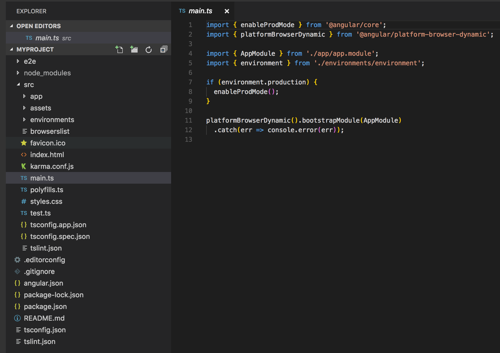

## Angular 

## Structure d'un projet Angular

Voici à quoi ressemble la structure : 

*   `App` Ce répertoire contient le module `AppModule` (app.module.ts), un `component` (app.component.ts), un `template` (app.component.html), le fichier `css` du template (app.component.css), le module de `navigation` (app-routing.module.ts) et le fichier de spécification du component (app.component.spec.ts).

*   `assets` Ce répertoire va contenir les contenus statiques, comme les images.

*   `environnements` Ce répertoire va permettre de définir l'environnement d'execution (production ou développement)

*   `index.html` C'est le fichier qui héberge l'application Angular (c'est le seul fichier html).

*   `karma.conf.js` C'est le fichier de configuration pour les tests

*   `main.ts` C'est le fichier de démarrage de l'application Angular

*   `polyfills.ts` c'est un fichier pour permettre à l'application de fonctionner sur casiment tous les navigateurs